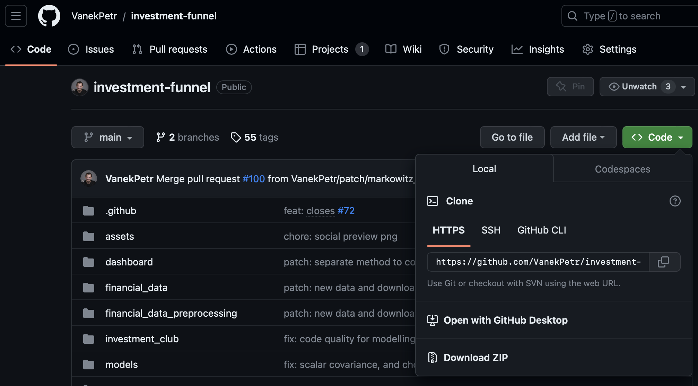

# Practical Financial Optimization 2025

Dear students 🧑‍🎓,

Welcome to the Practical Financial Optimization (PFO) course 🎉.

As part of the curriculum, we will leverage the open-source [Investment Funnel](https://github.com/VanekPetr/investment-funnel) project to move you closer to the real-world applications of mathematical models in finance. Please note that while the course description did not list Python as a prerequisite, **experimenting with the Python code is not compulsory but is shared as a bonus** for those who would like to dig deeper. Most of the models and concepts shown in Python will also be explained and then introduced in GAMS.

If you have any questions, please feel free to contact me at `petrr.vanekk@gmail.com`. Additionally, during the second week of the course, I will provide an introductory lecture on Git and the [Investment Funnel](https://github.com/VanekPetr/investment-funnel), where you will have the opportunity to ask questions.

---

## Getting Started with the Investment Funnel

### [I] Explore the Dashboard Application [Highly Recommended]

First and foremost, we **strongly encourage you to explore the `Investment Funnel` dashboard web application**.

➡️ **[https://investment-funnel.algostrata.com](https://investment-funnel.algostrata.com)**

It's very important to familiarize yourself with the application, especially the 'Market overview' tab. The data loaded in the application is **exactly the same data you will be using for your final project**, so understanding its structure now will be a great help later on. The dashboard is best viewed using the Google Chrome browser with adjusted page zoom.

### [II] Understand the Project's Structure

The project was recently split into two main components. Reading through the code of these two projects during the course (perhaps after the first week) may provide valuable hints for your final project.

* **The Dashboard ([Investment Funnel](https://github.com/VanekPetr/investment-funnel) on GitHub)**: This is the repository for the main web application. The `README.md` file in this project is particularly important, as it explains the funnel concept in detail and contains many useful links to the models you will learn about in this course.
* **`ifunnel`**: A Python [package available on PyPI](https://pypi.org/project/ifunnel/) that implements most of the optimization models. This package was developed in close collaboration with **Thomas Schmelzer**, an ex-Stanford and ex-ADIA quant with many years of experience. His other projects on his [GitHub profile](https://github.com/tschm) are also well worth exploring.

---

## Optional: For Those Who Want to Go Deeper

This section is for students interested in experimenting with the code on their own machines. The following steps are **entirely optional** and not required to complete the course.

### Install Python

The project is written in Python. If you want to run it locally, you'll need to install Python on your computer. The project is built with Python 3.12, though versions 3.11 or 3.13 should also be compatible. You can find a great tutorial on how to do this on the [Real Python](https://realpython.com/installing-python/) website.

### Download the Code and Get Set Up

To explore the code locally, you have two key projects you can download.

**1. The Dashboard Project (`Investment-Funnel`)**

This repository contains the code for the web application itself. You can get the code in two ways from its [GitHub page](https://github.com/VanekPetr/investment-funnel):

* **[Recommended]** Install [Git](https://git-scm.com/) and clone the repository. This allows you to easily get updates with the `git pull` command. It's also a great opportunity to create a free [GitHub account](https://github.com/).
* Download the repository as a ZIP file by clicking the green `Code` button and then `Download ZIP`.
    

      </a>
    

**2. The Models Package (`ifunnel`)**

This repository contains the Python source code for all the optimization models used in the dashboard. For those who want to understand the core logic, you can explore or download the code from the **[ifunnel GitHub page](https://github.com/tschm/funnel)**.

To efficiently study and edit the code from either project, a code editor like PyCharm (the free [Community Edition](https://www.jetbrains.com/pycharm/download/) is excellent), VS Code, or Cursor will be very helpful.

### Running the Dashboard Locally

To run the dashboard on your local machine, please follow the detailed instructions in the projects' README files or contact me via email.